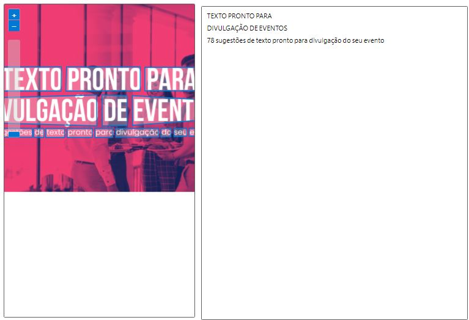

# Projeto de Reconhecimento de Texto em Imagens

Este repositório contém um projeto de reconhecimento de texto em imagens, mostrando o processo, os resultados e os aprendizados obtidos.

## Estrutura do Repositório
- **inputs/**: Contém as imagens utilizadas no projeto.
- **output/**: Contém os resultados do reconhecimento de texto.
- **README.md**: Explica o projeto, insights e aprendizados.

## Processo
1. As imagens foram carregadas na pasta `inputs/`.
2. As imagens passaram por um processo de reconhecimento de texto
3. Os resultados foram salvos na pasta `output/`.

## Insights e Possibilidades
- Aprendi a trabalhar com processamento de imagens e reconhecimento de texto.
- Entendi os desafios de imagens de baixa qualidade e como filtros podem melhorar os resultados.
- Possíveis aplicações incluem automação de tarefas, digitalização de documentos e extração de informações.

## Prints do Processo
**1º imagem processada:**

***
2º imagem processada:

